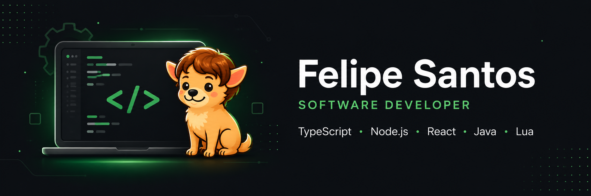

  

  
  

## 👋 Sobre mim

Me chamo Felipe, mas na internet provavelmente você vai me encontrar como String.

Sou apaixonado por tecnologia desde cedo e gosto principalmente de transformar ideias em software, resolver problemas e entender como as coisas funcionam por trás de cada solução.

Comecei programando para criar projetos e sistemas em jogos online. Hoje, levo essa mesma curiosidade para o desenvolvimento de aplicações reais, trabalhando principalmente com TypeScript, Node.js, React e Java.

Gosto de ambientes onde posso construir, experimentar, aprender e colaborar com outras pessoas — sempre buscando transformar desafios em soluções simples e úteis.

📍 Patos de Minas, MG — Brasil

## 💻 Tecnologias

**Stack principal**

  
  
  
  

**Também trabalho com**

  
  
  
  
  
  
  

**Ferramentas**

  
  
  
  

## 📊 GitHub

  
  

